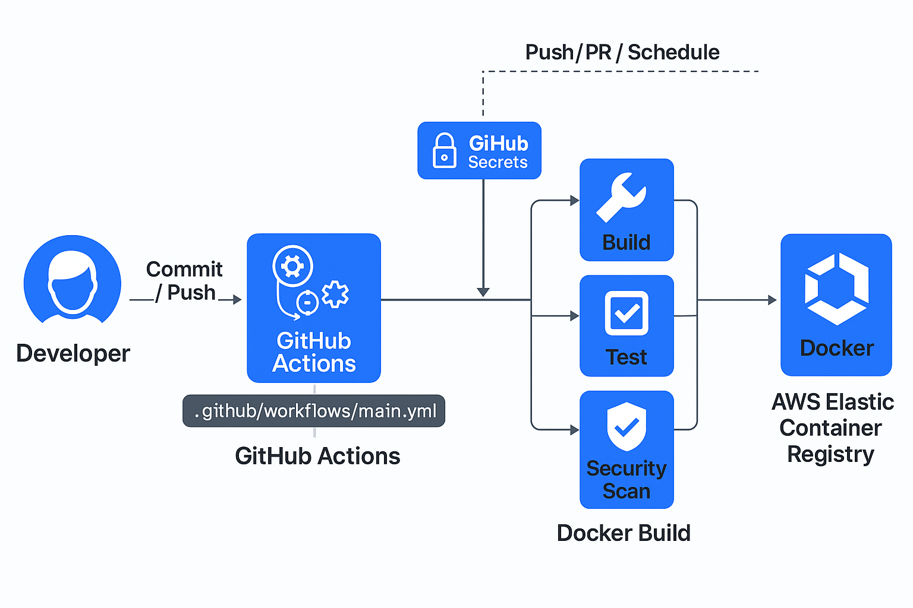
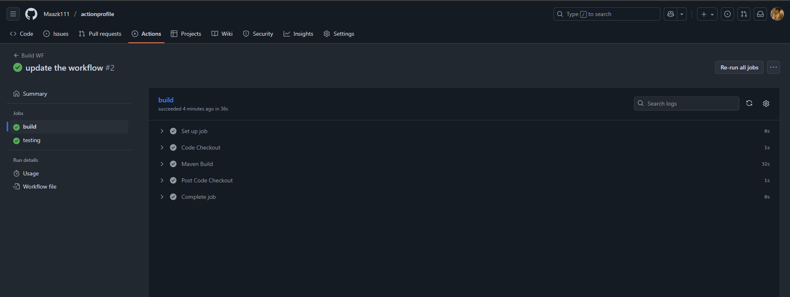
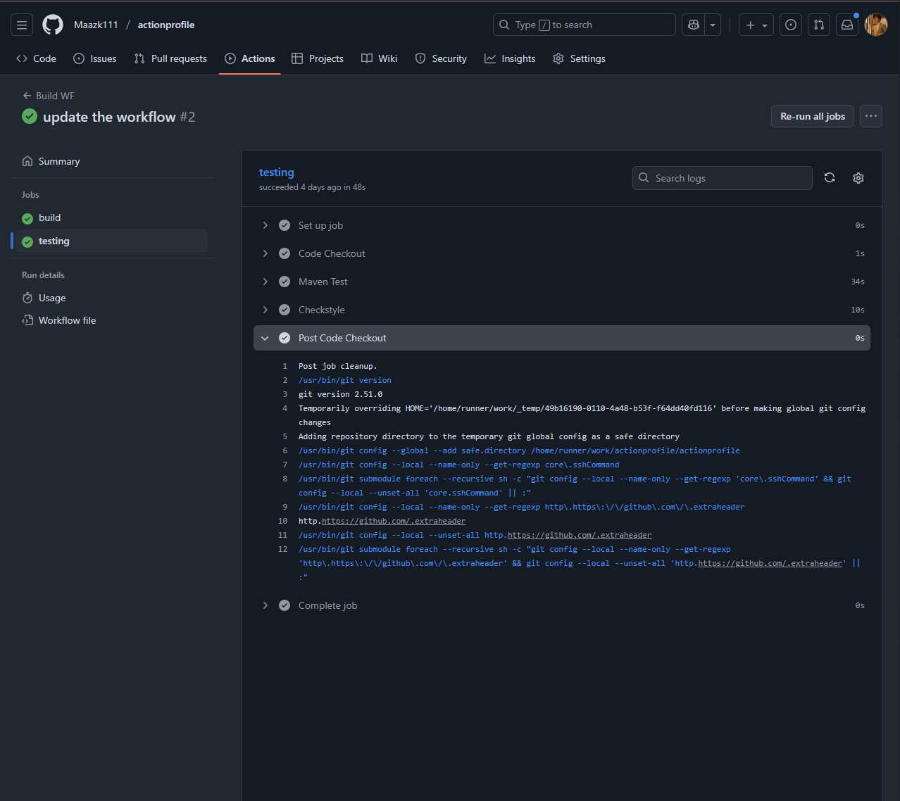
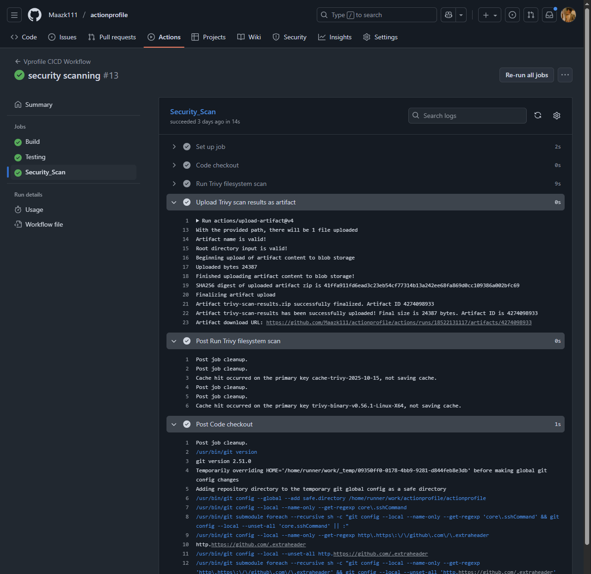
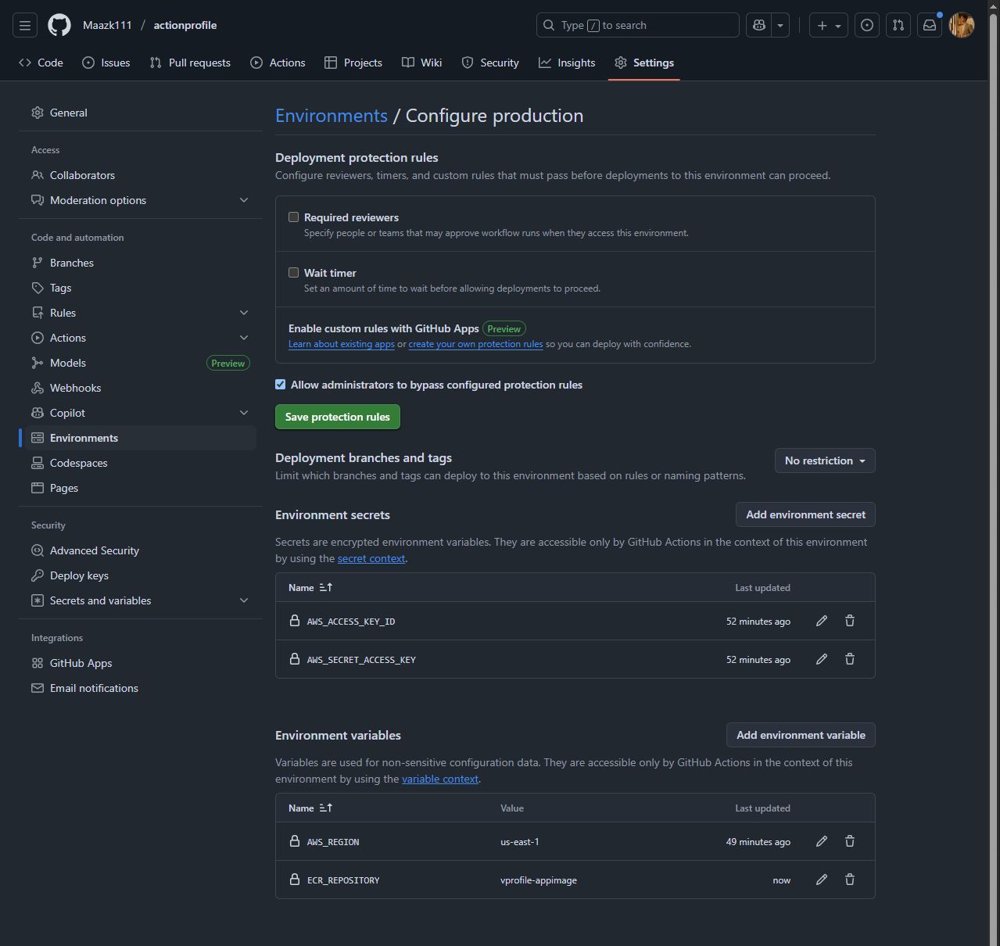
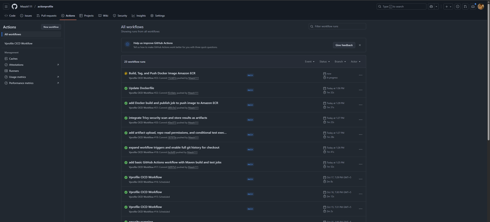
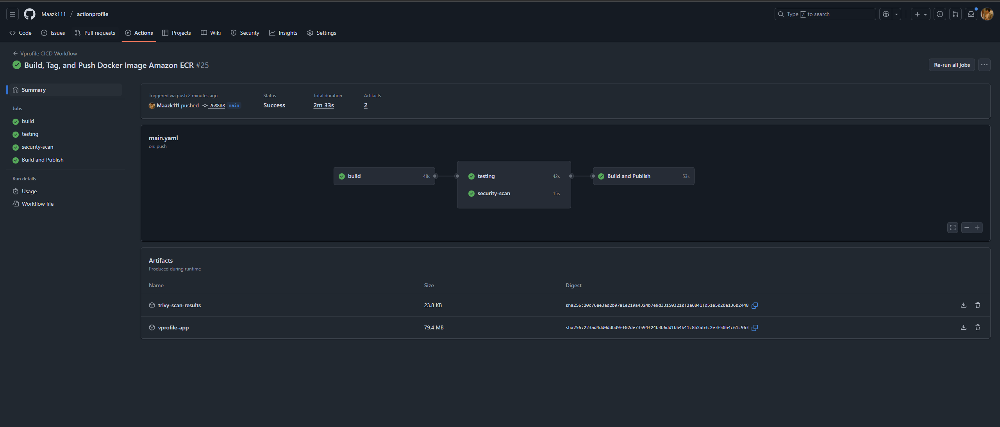
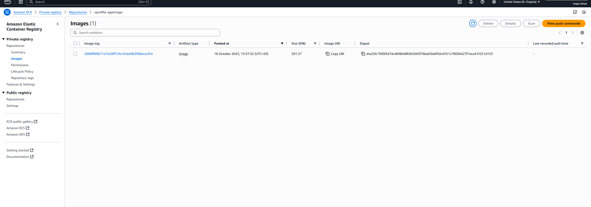

# ⚙️ GitHub Actions — CI/CD Pipeline for VProfile App

## 📘 Overview
This project demonstrates how to **build, test, scan, and deploy** a Java-based web application using **GitHub Actions CI/CD**.  
It automates the DevOps workflow from **source code commit → artifact creation → security scan → Docker image push → AWS ECR**.

The purpose of this repository is to showcase:
- 💡 **CI/CD Automation Skills** using GitHub Actions
- 🔐 **DevSecOps Practices** (Trivy vulnerability scanning)
- ☁️ **Cloud Integration** with AWS (ECR for container images)
- 🧩 **Workflow Design & Error Debugging**

---

## 🏗️ Architecture Diagram
<p align="center">
  
</p>

---

## 🧰 Tech Stack & Tools

| **Category** | **Tools / Services** |
|---------------|----------------------|
| **CI/CD Platform** | GitHub Actions |
| **Build Tool** | Maven |
| **Language** | Java |
| **Containerization** | Docker |
| **Security Scanning** | Aqua Trivy |
| **Cloud Registry** | AWS Elastic Container Registry (ECR) |
| **Version Control** | GitHub |
| **OS Runners** | Ubuntu-latest (GitHub-hosted) |
| **Secrets & Permissions** | GitHub Environments & GITHUB_TOKEN |

---

## 🧩 Step-by-Step Workflow (Inline with Snapshots)

### **1️⃣ Workflow Setup**
Created `.github/workflows/main.yml` and initialized the CI/CD pipeline with trigger events.

```yaml
on:
  push:
    branches:
      - main
  pull_request:
    branches:
      - main
  workflow_dispatch:
  schedule:
    - cron: "10 14 * * 1-5"
```

📸 **Workflow Trigger Configuration**  


---

### **2️⃣ Build Job**
- Checks out code from the repo.
- Runs Maven build to generate `.war` artifact.
- Uploads the artifact as a downloadable file in GitHub Actions.

```yaml
- name: Maven Build
  run: mvn install
```

📸 **Build Stage Output**  


---

### **3️⃣ Testing Job**
- Runs after the build job completes.
- Uses Maven to execute unit tests.

```yaml
- name: Run Tests
  run: mvn test
```

📸 **Test Execution Log**  


---

### **4️⃣ Artifact Upload**
- Stores the compiled `.war` file for future stages.
- Uses `actions/upload-artifact@v4`.

```yaml
- name: Upload Build Artifact
  uses: actions/upload-artifact@v4
  with:
    name: vprofile-app
    path: target/*.war
```

📸 **Artifact Uploaded to Actions Panel**  


---

### **5️⃣ Security Scan (DevSecOps Integration)**
- Added **Aqua Security’s Trivy** for vulnerability scanning.
- Parallel execution with testing job.

```yaml
- name: Run Trivy Scan
  uses: aquasecurity/trivy-action@0.28.0
  with:
    scan-type: 'fs'
    scan-ref: '.'
    format: 'json'
    exit-code: 0
    vuln-type: 'os,library'
```

📸 **Trivy Security Scan Report**  


---

### **6️⃣ Secrets & AWS Configuration**
- Configured GitHub Secrets for AWS credentials:
    - `AWS_ACCESS_KEY_ID`
    - `AWS_SECRET_ACCESS_KEY`
    - `AWS_REGION = us-east-1`
- These secrets authenticate with ECR before pushing images.

📸 **GitHub Secrets Configuration**  


---

### **7️⃣ Docker Build & Push Job**
- Builds Docker image using a **multi-stage Dockerfile**.
- Pushes image to **Amazon ECR** with unique commit SHA tag.

```yaml
- name: Build and Push Docker Image
  env:
    ECR_REPOSITORY: vprofile-app-image
    IMAGE_TAG: ${{ github.sha }}
  run: |
    docker build -f docker-files/app/multi-stage/Dockerfile       -t $ECR_REGISTRY/$ECR_REPOSITORY:$IMAGE_TAG .
    docker push $ECR_REGISTRY/$ECR_REPOSITORY:$IMAGE_TAG
```

📸 **Docker Build Process**  



---

### **8️⃣ Conditional Notifications & Permissions**
- Added permissions to restrict repository write access:
  ```yaml
  permissions:
    contents: read
  ```
- Added notification if build fails:
  ```yaml
  - name: Notify if Build Fails
    if: failure()
    run: echo "🚨 Build job failed! Please check logs."

---

### **9️⃣ Full Workflow Execution**
All jobs (Build → Test → Security Scan → Docker Push) executed successfully.  
Parallel and dependent jobs used `needs:` relationships for order control.

📸 **Final Pipeline Overview (Success)**  


📸 **Artifact & Docker Outputs**  


---

## 🧠 Key Learnings & Skills Demonstrated
- **CI/CD Mastery:** Multi-job workflows with dependencies
- **GitHub Actions Syntax:** YAML-based automation with `if:`, `needs:`, and job triggers
- **Security Integration:** Trivy scanning for vulnerabilities
- **Environment Management:** Secrets and Variables for secure credentials
- **Docker & AWS Integration:** Build, tag, and push images to ECR
- **Error Handling:** Conditional steps and debugging in workflows
- **DevSecOps Practice:** Integrated code scanning and secure deployments

---

## 🧹 Cleanup / Cost Notes
- AWS ECR storage incurs minimal costs (~$0.10/month).
- No EC2 or managed service charges if not running continuously.
- Regularly delete unneeded ECR images and artifacts.

---

## 👨‍💻 Recruiter Note
> This project replicates a **real-world enterprise CI/CD pipeline**, integrating  
> **build, test, security scan, and Docker image publishing** to AWS.  
> It demonstrates end-to-end **DevOps and DevSecOps workflow automation skills** using GitHub Actions.

